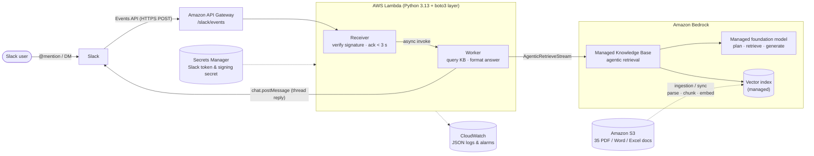
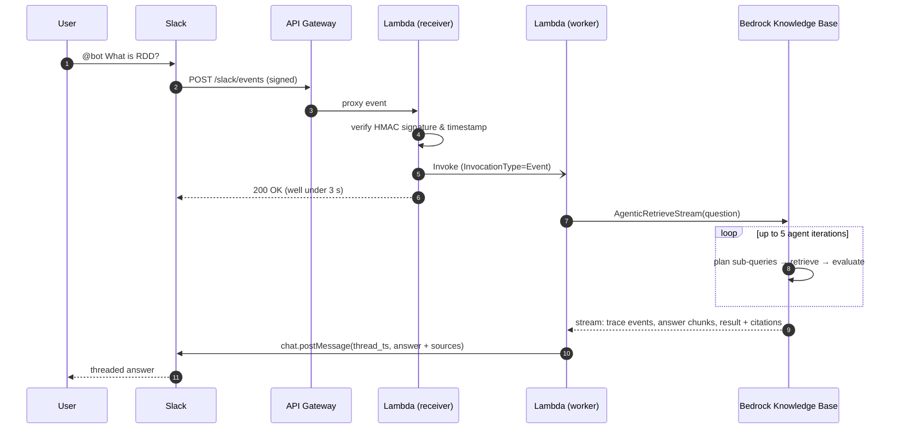

# Bedrock Agentic RAG Slack Bot

### A serverless Slack assistant that answers questions from your company's documents, with citations, using Amazon Bedrock agentic retrieval

[](https://github.com/Hadi2468/bedrock-agentic-rag-slack-bot/actions/workflows/ci.yml)
[](https://www.python.org/)
[](https://aws.amazon.com/bedrock/knowledge-bases/)
[](https://aws.amazon.com/serverless/sam/)
[](https://api.slack.com/apis/events-api)
[](LICENSE)

Company knowledge is scattered across PDFs, Word files, spreadsheets and old Slack threads, and
*"who knows about X?"* is one of the most common questions in any workspace.

This bot answers those questions **where people already work**. Mention it in a channel or send
it a DM, and it searches **35 internal documents** (PDF, Word, Excel) through an
**Amazon Bedrock managed Knowledge Base**. A managed foundation model **plans and runs several
retrieval steps** before writing a grounded answer. The reply is posted **in the thread**, with
the **source documents it cites**. If the documents don't contain the answer, the bot says so
instead of making one up.


*A live answer in Slack: formatted for Slack, grounded in the knowledge base, with its source*

---

## ✨ Highlights

| Capability | How |
|---|---|
| **Agentic&nbsp;retrieval** | Bedrock `AgenticRetrieveStream`: the model breaks the question into sub-queries, retrieves and checks the results over up to 5 iterations, and expands to full documents when a chunk isn't enough |
| **Grounded&nbsp;and&nbsp;cited** | Only the retrieval results the answer actually cites are listed as sources; out-of-scope questions get "I can't find this" instead of a guess |
| **Meets&nbsp;Slack's&nbsp;3&#8209;second&nbsp;deadline** | The receiver acknowledges at once and hands the slow LLM work to an asynchronous worker invocation, so Slack never retries and users never get duplicate answers |
| **Verified&nbsp;requests** | Every request is checked with an HMAC-SHA256 Slack signature (constant-time compare, 5-minute replay window); unsigned calls get `401` |
| **Secrets&nbsp;out&nbsp;of&nbsp;config** | Slack token and signing secret live in AWS Secrets Manager, not in environment variables or code |
| **Least&#8209;privilege&nbsp;IAM** | The function can read one secret, query one knowledge base, call the Bedrock actions agentic retrieval needs, and invoke itself, nothing more |
| **Slack&#8209;native&nbsp;answers** | Threaded replies, DM support, and LLM Markdown converted to Slack `mrkdwn`, so no raw `**` or `##` |
| **Infrastructure&nbsp;as&nbsp;code** | One AWS SAM template builds the API, Lambda, boto3 layer, IAM, JSON logs and CloudWatch alarms; `sam deploy` recreates it all |
| **Tested&nbsp;offline** | 49 pytest tests (97% coverage) with fake Bedrock, Lambda, Secrets Manager and Slack clients: no AWS account, no network, no cost; CI on every push |

---

## 🔀 Architecture

<!-- To replace with the draw.io export: save it as assets/architecture.png and use
      -->



### Request lifecycle



See **[DESIGN.md](DESIGN.md)** for the design decisions, trade-offs, failure modes, security and cost model.

---

## 🚀 Quickstart

### Prerequisites

- An AWS account with Amazon Bedrock access (e.g. `us-east-1`)
- [AWS SAM CLI](https://docs.aws.amazon.com/serverless-application-model/latest/developerguide/install-sam-cli.html) and Python 3.13
- A Slack workspace where you can install apps

### 1. Create the knowledge base

1. Upload your documents (PDF, DOCX, XLSX, ...) to a **private** S3 bucket (Block Public Access on).
2. In the Bedrock console, go to **Knowledge Bases → Create Managed KB**, choose the bucket as the data source, and **Sync**.
3. Test it with *Agentic retrieval with answer generation*, then note the **Knowledge Base ID**.

### 2. Create the Slack app

1. Go to <https://api.slack.com/apps>, choose **Create New App → From a manifest**, and paste [`slack/app-manifest.yaml`](slack/app-manifest.yaml).
2. Install it to your workspace and copy the **Bot User OAuth Token** (`xoxb-...`) and the **Signing Secret**.

### 3. Store the credentials and deploy

```bash
git clone https://github.com/Hadi2468/bedrock-agentic-rag-slack-bot.git
cd bedrock-agentic-rag-slack-bot

aws secretsmanager create-secret --name slack-rag/slack \
    --secret-string '{"bot_token":"xoxb-...","signing_secret":"..."}'

sam build
sam deploy --guided       # asks for KnowledgeBaseId and SlackSecretArn, then saves them
```

### 4. Connect Slack

Copy the `SlackEventsRequestUrl` stack output into **Slack app → Event Subscriptions → Request URL**.
Slack sends a `url_verification` challenge and the function answers it automatically.
Invite the bot to a channel (`/invite @bot`) and ask away.

To update after a code change: `sam build && sam deploy`. To remove everything: `sam delete`.

---

## 🔭 Observability

The function writes **structured JSON logs** to CloudWatch, recording the event ID, channel, user,
latency, number of cited sources and answer length (never full message bodies or tokens),
so they can be queried with CloudWatch Logs Insights. Agentic retrieval trace events
(planning, retrieval, full-document expansion) are logged at debug level for tuning retrieval
quality.

Measured on the live deployment for *"What is RDD?"*: **6.8 s from question to answer**, from a
single Slack delivery. The receiver acknowledged Slack immediately, so there were no retries and
no duplicate answers.

| Alarm | Fires when |
|---|---|
| `FunctionErrorsAlarm` | Any error in 5 minutes (Bedrock, Slack or code) |
| `FunctionDurationAlarm` | p95 duration above 90 s for 15 minutes (approaching the 120 s timeout) |

```bash
sam logs --stack-name bedrock-agentic-rag-slack-bot --tail    # live logs
```

---

## 🧪 Testing

```bash
python -m venv .venv && source .venv/bin/activate    # Windows: .venv\Scripts\activate
pip install -r requirements-dev.txt

ruff check . && ruff format --check .
pytest --cov                                         # fully offline, coverage gate 90%
cfn-lint template.yaml
```

All AWS and Slack clients are **dependency-injected**, so the tests use in-memory fakes and
check behaviour: valid, tampered, stale and missing signatures; Slack retries ignored;
bot messages and edits filtered; async hand-off payloads; parsing of the Bedrock event stream
(final answer vs. streamed chunks vs. error events); citation-to-source mapping;
Markdown → `mrkdwn` conversion; and error replies when Bedrock or Slack fail.
CI runs ruff, pytest and cfn-lint on every push and pull request.

---

## 🗂️ Project structure

<pre>
<b>bedrock-agentic-rag-slack-bot/</b>
├── src/app/
│   ├── handler.py          # Lambda entry point: receiver (sync) + worker (async)
│   ├── knowledge_base.py   # AgenticRetrieveStream client, stream parsing, citations
│   ├── formatting.py       # Markdown → Slack mrkdwn, sources block, length limit
│   ├── slack_security.py   # HMAC-SHA256 request signature verification
│   ├── slack_api.py        # chat.postMessage (standard library only)
│   └── config.py           # settings + Secrets Manager credentials
├── layer/requirements.txt  # boto3 version that supports agentic retrieval
├── slack/app-manifest.yaml # Slack app scopes and events
├── tests/                  # offline pytest suite (49 tests)
├── assets/                 # diagrams and screenshots
├── <b>template.yaml</b>           # AWS SAM: API, Lambda, layer, IAM, logs, alarms
├── DESIGN.md               # design decisions and trade-offs
└── .github/workflows/ci.yml
</pre>

---

## ⚙️ Configuration

| SAM parameter / env var | Default | Purpose |
|---|---|---|
| `KnowledgeBaseId` / `KNOWLEDGE_BASE_ID` | — | Bedrock managed knowledge base to query |
| `SlackSecretArn` / `SLACK_SECRET_ARN` | — | Secret holding `bot_token` and `signing_secret` |
| `MaxAgentIterations` / `MAX_AGENT_ITERATIONS` | `5` | Agentic retrieval iterations (2-5): accuracy vs. latency and cost |
| `GuardrailId`, `GuardrailVersion` | *(empty)* | Optional Bedrock guardrail applied during retrieval |
| `LogRetentionInDays` | `30` | CloudWatch log retention |

---

## 🛣️ Roadmap

➡️ Multi-turn conversations: Slack thread history or AgentCore Memory as conversation context  
➡️ Exactly-once processing with DynamoDB idempotency on `event_id`  
➡️ Stream partial answers to Slack with `chat.update` for faster perceived latency  
➡️ Offline RAG evaluation (faithfulness, answer relevance) on a golden question set in CI  
➡️ Automatic knowledge base sync when documents change in S3  
➡️ Per-channel metadata filters (e.g. HR documents only in `#hr`)  

---

## 🧰 Tech stack

- **LLM / RAG:** Amazon Bedrock managed Knowledge Base, agentic retrieval, managed foundation model, optional Guardrails
- **Compute and API:** AWS Lambda (Python 3.13, arm64) with a boto3 layer, Amazon API Gateway (REST)
- **Data:** Amazon S3 (documents), managed vector index
- **Security and operations:** AWS Secrets Manager, IAM, CloudWatch Logs and Alarms
- **Integration:** Slack Events API, Slack Web API, Slack app manifest
- **Engineering:** AWS SAM, pytest, ruff, cfn-lint, GitHub Actions

---

## License

MIT

---
## 🧑🏻‍💻 Author
<pre>
<b> Hadi Hosseini </b>    
 AI/ML Engineer | Data Engineer | Biomedical Data Scientist  
 www.linkedin.com/in/hadi468
</pre>
