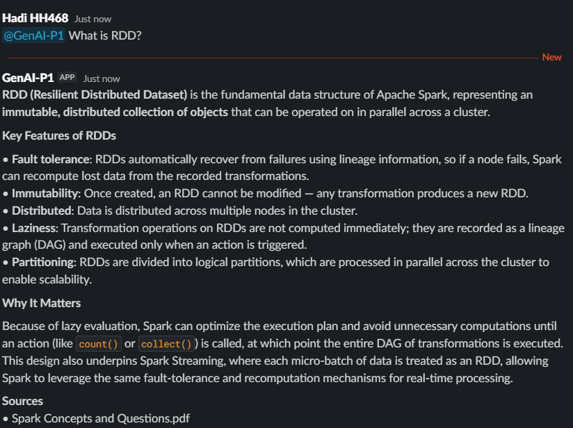
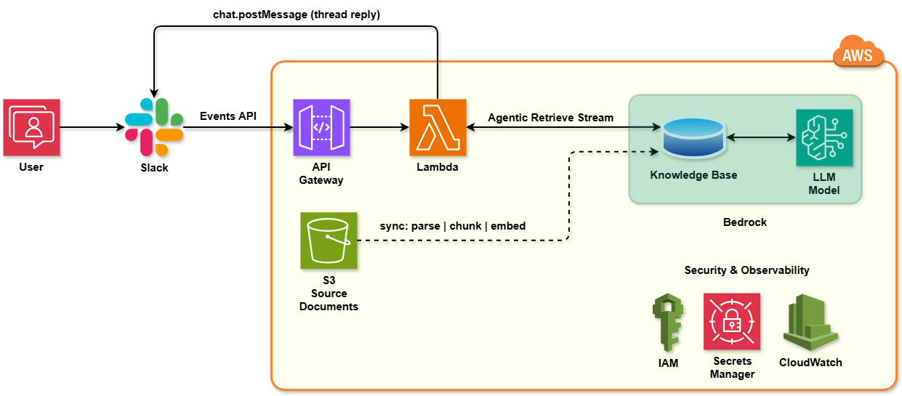
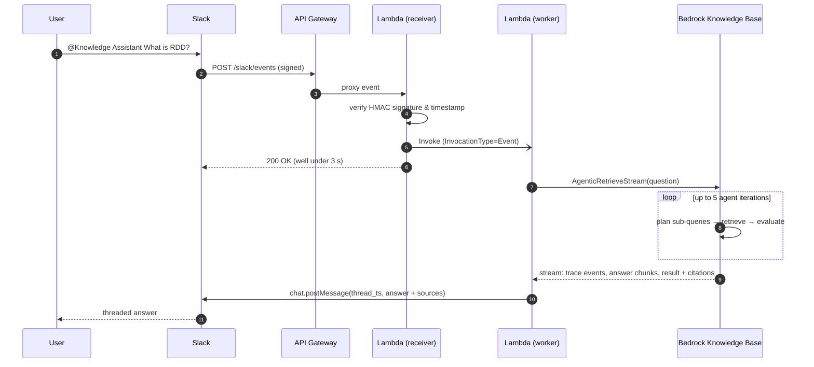

# Slack × Amazon Bedrock — Agentic RAG Knowledge Assistant

[](https://github.com/Hadi2468/bedrock-agentic-rag-slack-bot/actions/workflows/ci.yml)


A serverless **Retrieval-Augmented Generation (RAG)** assistant that lives in Slack.
Employees ask questions in plain English, either by `@mentioning` the bot in a channel or in a direct message. The bot answers from the organisation's **own documents**: 35 PDF, Word and Excel files stored in Amazon S3 and indexed by an **Amazon Bedrock managed Knowledge Base**. Answers come back in a thread, with the source documents they cite.

## Demo

<p align="center">
  
</p>

---

## Why this project

Knowledge is scattered across PDFs, wikis, spreadsheets and old Slack threads, and "who knows about X?" is one of the most common questions in any workspace. This assistant brings grounded, cited answers to where people already work. If the documents don't contain the answer, it says so instead of making one up.

## Key features

| | |
|---|---|
| **Agentic retrieval** | Uses Bedrock's `AgenticRetrieveStream` API. A managed foundation model splits complex questions into sub-queries, retrieves over several iterations (up to 5), pulls in full documents when needed, and writes a cited answer. |
| **Grounded & cited** | Answers include the source documents they cite. When the knowledge base doesn't cover a question, the bot says it can't find reliable information. |
| **Meets Slack's 3-second deadline** | The receiver checks the request and acknowledges it right away, then hands the slow LLM work to an asynchronous worker invocation. Slack never times out, so users never get duplicate answers. |
| **Secure by default** | Every request is checked with an HMAC-SHA256 Slack signature and replay protection. Secrets live in AWS Secrets Manager. IAM follows least privilege. Bedrock Guardrails are optional. |
| **Slack-native UX** | Replies go in threads. DMs are supported. The LLM's Markdown is converted to Slack `mrkdwn`, so answers render cleanly instead of showing raw `**` and `##`. |
| **Production hygiene** | Infrastructure as Code (AWS SAM), structured JSON logs, CloudWatch alarms, 49 unit tests at 97% coverage, and CI with ruff + pytest + cfn-lint. |

## Architecture

<!-- To replace with the draw.io export: save it as assets/architecture.png and use
      -->


### Request lifecycle



The design decisions, trade-offs and failure modes are written up in **[DESIGN.md](DESIGN.md)**.

## Tech stack

- **LLM / RAG:** Amazon Bedrock managed Knowledge Base, Agentic Retrieval (`AgenticRetrieveStream`), managed foundation model, optional Bedrock Guardrails
- **Compute & API:** AWS Lambda (Python 3.13, arm64), Lambda layer (boto3 1.43), Amazon API Gateway (REST, regional)
- **Data:** Amazon S3 (source documents), managed vector index
- **Security & ops:** AWS Secrets Manager, IAM least privilege, CloudWatch Logs (JSON) and Alarms
- **Integration:** Slack Events API, Slack Web API, Slack app manifest
- **Engineering:** AWS SAM, pytest, ruff, cfn-lint, GitHub Actions

## Repository layout

```
.
├── src/app/
│   ├── handler.py          # Lambda entry point: receiver (sync) + worker (async)
│   ├── knowledge_base.py   # Bedrock AgenticRetrieveStream client, stream parsing, citations
│   ├── formatting.py       # Markdown → Slack mrkdwn, sources block, length limits
│   ├── slack_security.py   # HMAC-SHA256 request signature verification
│   ├── slack_api.py        # chat.postMessage (stdlib only)
│   └── config.py           # env settings + Secrets Manager credentials
├── layer/requirements.txt  # boto3 version that supports agentic retrieval
├── tests/                  # 49 unit tests, all AWS/Slack calls faked
├── slack/app-manifest.yaml # one-click Slack app configuration
├── assets/                 # architecture diagrams and screenshots
├── template.yaml           # AWS SAM: API Gateway, Lambda, layer, IAM, logs, alarms
├── DESIGN.md               # design decisions & trade-offs
└── .github/workflows/ci.yml
```

## Deploy it yourself

### Prerequisites

- AWS account with Amazon Bedrock access in your region (e.g. `us-east-1`)
- [AWS SAM CLI](https://docs.aws.amazon.com/serverless-application-model/latest/developerguide/install-sam-cli.html) and Python 3.13
- A Slack workspace where you can install apps

### 1. Create the knowledge base

1. Upload your documents (PDF, DOCX, XLSX, …) to a **private** S3 bucket (Block Public Access on).
2. In the Bedrock console, go to **Knowledge Bases → Create Managed KB**, choose the bucket as the data source, and **Sync**.
3. Test it in the console with *Agentic retrieval with answer generation*, then note the **Knowledge Base ID**.

### 2. Create the Slack app

1. Go to <https://api.slack.com/apps>, choose **Create New App → From a manifest**, and paste [`slack/app-manifest.yaml`](slack/app-manifest.yaml). You'll set the Request URL in step 4.
2. Install the app to your workspace and copy the **Bot User OAuth Token** (`xoxb-…`) and the **Signing Secret**.

### 3. Store the Slack credentials and deploy

```bash
aws secretsmanager create-secret \
  --name slack-rag/slack \
  --secret-string '{"bot_token":"xoxb-...","signing_secret":"..."}'

sam build
sam deploy --guided \
  --parameter-overrides KnowledgeBaseId=<KB_ID> SlackSecretArn=<SECRET_ARN>
```

### 4. Connect Slack to the API

Copy the `SlackEventsRequestUrl` stack output into **Slack app → Event Subscriptions → Request URL**. Slack sends a `url_verification` challenge, and the function answers it automatically. Then invite the bot to a channel (`/invite @Knowledge Assistant`) and ask away.

### Configuration

| Parameter / env var | Description | Default |
|---|---|---|
| `KnowledgeBaseId` / `KNOWLEDGE_BASE_ID` | Bedrock managed knowledge base ID | — |
| `SlackSecretArn` / `SLACK_SECRET_ARN` | Secret with `bot_token` and `signing_secret` | — |
| `MaxAgentIterations` / `MAX_AGENT_ITERATIONS` | Agentic retrieval iterations (2–5) | `5` |
| `GuardrailId`, `GuardrailVersion` | Optional Bedrock guardrail | empty |

## Development

```bash
python -m venv .venv && source .venv/bin/activate   # Windows: .venv\Scripts\activate
pip install -r requirements-dev.txt

ruff check . && ruff format --check .   # lint + formatting
pytest --cov                            # unit tests (coverage gate: 90%)
cfn-lint template.yaml                  # IaC lint
```

The tests replace Bedrock, Lambda, Secrets Manager and Slack with in-memory fakes, so they run offline without AWS credentials. CI runs the same checks on every push and pull request.

## Security notes

- **Request authenticity:** every inbound request is checked against Slack's `v0` HMAC-SHA256 signature using a constant-time comparison. Requests older than 5 minutes are rejected (replay protection).
- **Secrets:** the bot token and signing secret are read from Secrets Manager at cold start. They are never stored in environment variables or source control.
- **Least-privilege IAM:** the function can only read its one secret, query its one knowledge base, call the Bedrock actions that agentic retrieval needs, and invoke itself.
- **Data:** the S3 bucket is private, and logs record IDs, latency and counts rather than full message bodies.

## Roadmap

- Multi-turn conversations: pass the Slack thread history (or AgentCore Memory session binding) as conversation context
- DynamoDB idempotency keyed on `event_id` for exactly-once processing
- Stream partial answers to Slack with `chat.update` for faster perceived latency
- Offline RAG evaluation (faithfulness, answer relevance) on a golden question set, run in CI
- S3 event-driven automatic knowledge base sync when documents change
- Per-channel metadata filters (e.g. HR documents only in `#hr`)

## License

[MIT](LICENSE) © Hadi Hosseini
